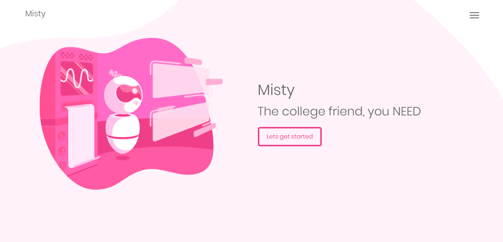

# Misty

This is a webpage we created for college project. Simple HTML, CSS, and Javascript.

## Getting Started

There's nothing much. We just create a database for loging in and try to connect you to a web-based chatbot to listen to your needs.

### Prerequisites

All you need to get this project running is Xampp, or any server application

## Built With

* [Chatteron.io](https://chatteron.io/) - Our Chatbot host

## Authors

* **Madhur Maurya** - *Logins systems and Chatbot* - [emem365](https://github.com/emem365)
* **Jayesh Mirchandani** - *Web Developer* - [jayesh-codes](https://github.com/jayesh-codes)

## License

This project is licensed under the MIT License - see the [LICENSE](LICENSE) file for details

## Acknowledgments

* A huge thanks to [Chatteron.io](https://chatteron.io/) providing free chatbot online for our project
